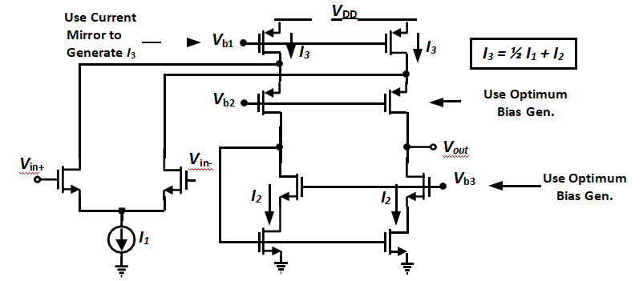

<h1>Folded Cascode Operational Amplifier</h1>
<figure>
    

    
<caption>Folded Cascode Operational Amplifier</caption>

    
<em><caption>Credits: Prof. Ahmed Nader</caption></em>

</figure>

<h2><u>1. Specifications</u></h2>
<ul>
    <li>VDD = 3.3V</li>
    <li>VinCM = VDD/2</li>
    <li>ADC > 55 dB(DC differential gain)</li>
    <li>GBW > 100 MHz for a load capacitance of CL = 2pF</li>
    <li>Slew Rate > 100 V/microsec</li>
    <li>Output Swing > 1.5VPP(Definition of swing is when the DC-gain drops by 10dB)</li>
    <li>Input referred thermal noise density < 10nV/sqrt(Hz)</li>
    <li>PM > 60 degrees</li>
    <li>Minimize Power Consumption</li>
</ul>
<h2><u>3. Simulation Procedures</u></h2>

